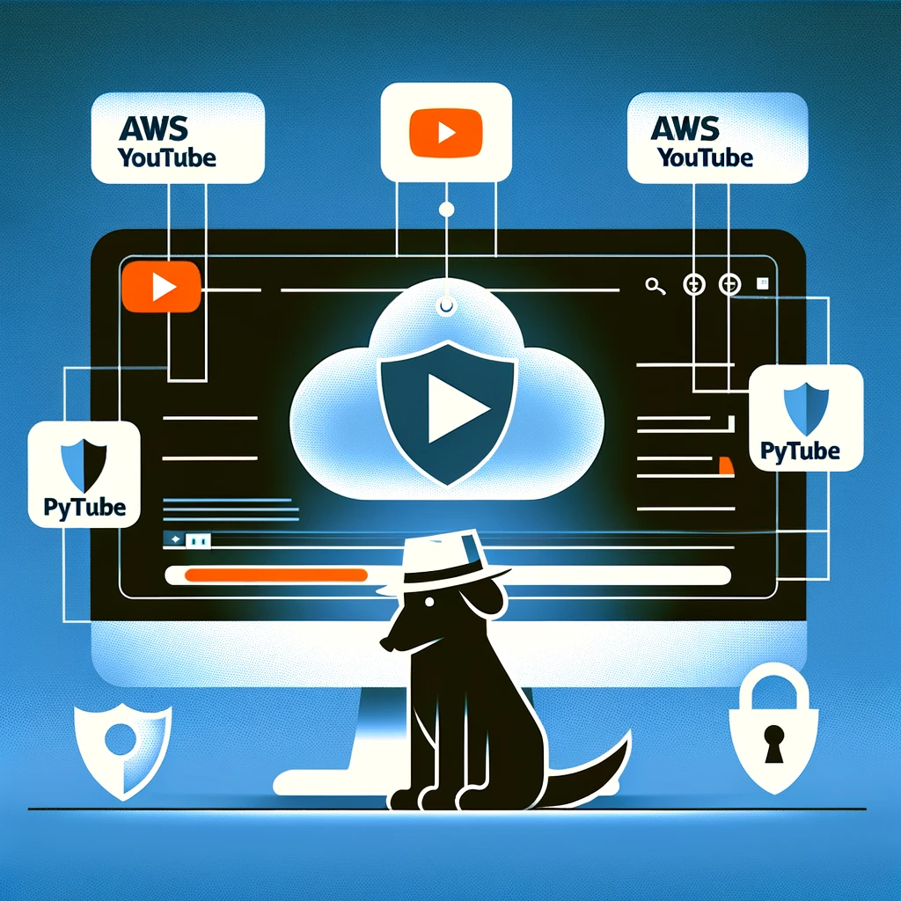

# 🥷 OSINTube-RealTimeGuard

**Real-time YouTube threat detection using AWS AI services for monitoring digital spaces and sentiment analysis.**



## 🚀 Overview

OSINTube-RealTimeGuard is an advanced OSINT (Open Source Intelligence) platform that monitors YouTube content in real-time to detect potential security threats, hate speech, and suspicious activities. Built with AWS cloud infrastructure and powered by LLaMA AI.

## ✨ Key Features

### 🔍 **Intelligence Gathering**
- **YouTube API Integration**: Automated comment collection and video analysis
- **Multi-language Support**: Translates and processes content in multiple languages
- **Real-time Monitoring**: Continuous surveillance of digital spaces

### 🤖 **AI-Powered Analysis**
- **AWS Bedrock LLaMA**: Advanced threat detection using Meta's LLaMA 4 Scout model
- **Sentiment Analysis**: NLTK-powered emotion and intent classification
- **Smart Filtering**: Adaptive algorithms to identify critical content

### 📊 **Interactive Dashboard**
- **Streamlit Interface**: Real-time data visualization and threat analysis
- **Dynamic Charts**: Sentiment distribution and threat pattern analysis
- **User-friendly Reports**: Detailed threat assessments with evidence

### ☁️ **Cloud Infrastructure**
- **AWS S3**: Scalable data storage for datasets and analysis results
- **DynamoDB**: Fast metadata and analysis tracking
- **Docker**: Containerized deployment for consistency
- **Terraform**: Infrastructure as Code for reproducible deployments

## 🛠️ Tech Stack

```
Frontend:     Streamlit • Plotly • HTML/CSS
Backend:      Python • AWS Bedrock • NLTK
AI/ML:        LLaMA 4 Scout • Sentiment Analysis • NLP
Cloud:        AWS (S3, DynamoDB, Bedrock, ECR)
DevOps:       Docker • Terraform • CI/CD
APIs:         YouTube Data API • Google Translate
```

## 🏗️ Architecture

```
YouTube API → Data Collection → S3 Storage → LLaMA Analysis → Threat Detection → Dashboard
     ↓              ↓              ↓             ↓              ↓             ↓
  Comments      Translation    Preprocessing   AI Analysis   Classification  Visualization
```

## 🚀 Quick Start

### Prerequisites
- AWS Account with Bedrock access
- YouTube Data API key
- Docker installed

### Deployment
```bash
# Clone repository
git clone https://github.com/your-username/OSINTube-RealTimeGuard.git
cd OSINTube-RealTimeGuard

# Deploy infrastructure
cd iac
terraform init
terraform apply

# Build and deploy application
./build.sh
```

### Local Development
```bash
# Install dependencies
pip install -r requirements.txt

# Set environment variables
export YOUTUBE_API_KEY="your_key_here"
export AWS_REGION="us-east-1"

# Run application
streamlit run app/main.py
```

## 📈 Use Cases

- **Security Monitoring**: Detect threats against public figures or institutions
- **Brand Protection**: Monitor mentions and sentiment around your brand
- **Research**: Analyze public opinion and social trends
- **Content Moderation**: Identify harmful content at scale

## 🎯 Demo

- **Live Application**: [app.dataiesb.com/osintube](https://app.dataiesb.com/osintube)
- **Video Demo**: [YouTube Demo Video](https://www.youtube.com/watch?v=7DeVyUtODWM)

## 🤝 Contributing

Contributions are welcome! Please read our contributing guidelines and submit pull requests.

## 📄 License

This project is licensed under the MIT License - see the LICENSE file for details.

## 👨‍💻 Author

**Roberto Moreira Diniz**  
DataOps Engineer & OSINT Enthusiast  
🥷🏿 Specialized in threat detection and data intelligence

---

⚠️ **Disclaimer**: This tool is for educational and research purposes. Always comply with platform terms of service and applicable laws.
# Build test Sat Sep 14 01:57:13 UTC 2025
